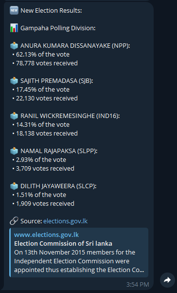
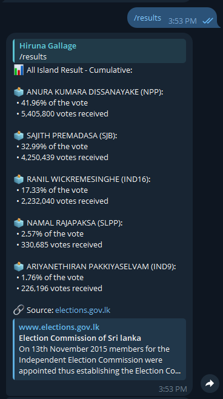
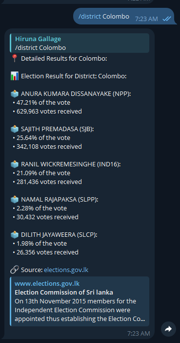
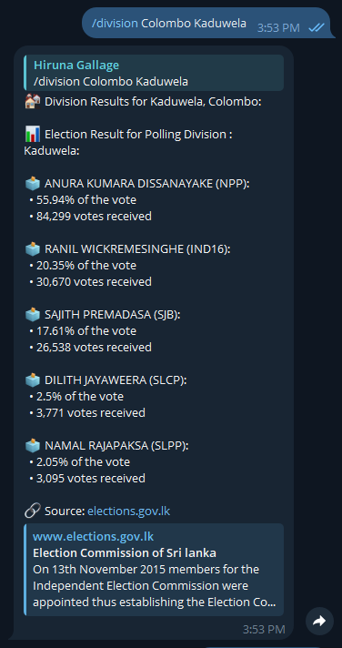

# Sri Lanka Election Results Bot

This Telegram bot provides users with the latest election results in Sri Lanka. Users can check overall results, detailed district results, and results for specific divisions. The bot also supports live subscription to election updates.

## Features
- Get **overall election results**.
- Fetch detailed **results for specific districts**.
- Retrieve results for **specific divisions** within districts.
- **Subscribe** to receive the latest election updates.
- **Admin commands** to enable or disable the bot.

## Bot Commands

### Public Commands
- `/start` - Start interacting with the bot and automatically subscribe to updates.
- `/help` - View a list of available commands.
- `/results` - Check the overall election results.
- `/district [district]` - Get detailed results for a specific district (e.g., `/district Colombo`).
- `/division [district] [division]` - Get results for a specific division within a district (e.g., `/division Colombo Medawachchiya`).
- `/subscribe` - Subscribe to receive the latest election updates.
- `/unsubscribe` - Unsubscribe from election updates.

### Admin Commands
- `/enable` - Enable the bot and allow all users to interact with it.
- `/disable` - Disable the bot and block all commands related to the election results.

## How It Works

1. **Real-time Election Results**: The bot fetches data from an external API and presents it to users based on their queries.
2. **Live Subscriptions**: Users can subscribe to live updates, which are sent automatically when there are new election results.
3. **Admin Control**: Only the admin can enable or disable the bot once the election ends.

## Screenshots

## License

This project is licensed under the GPL-3.0 License. See the LICENSE file for details.

### Contact

- Author: Hiruna Gallage
- Website: [hiruna.dev](https://hiruna.dev)
- Email: [hello@hiruna.dev](mailto:hello@hiruna.dev)
